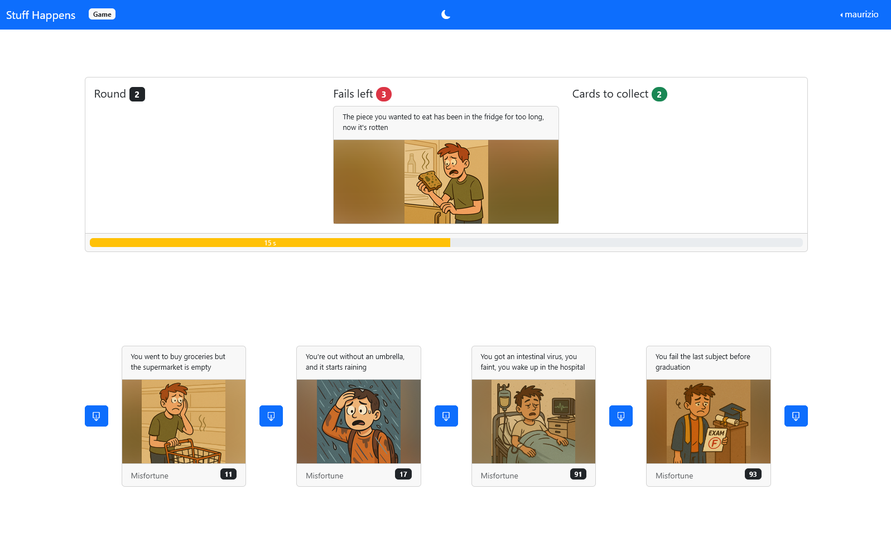
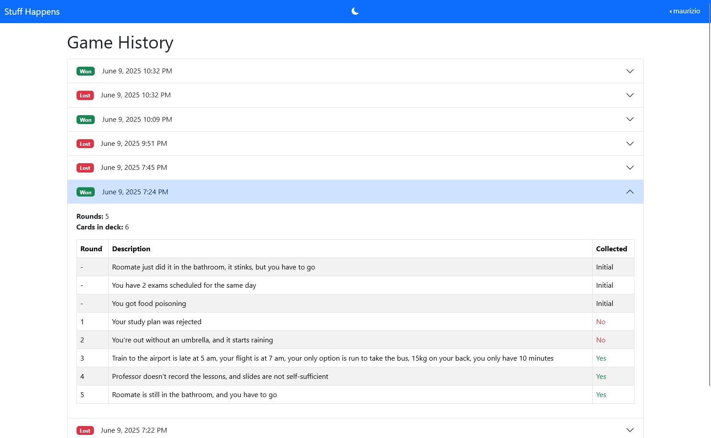
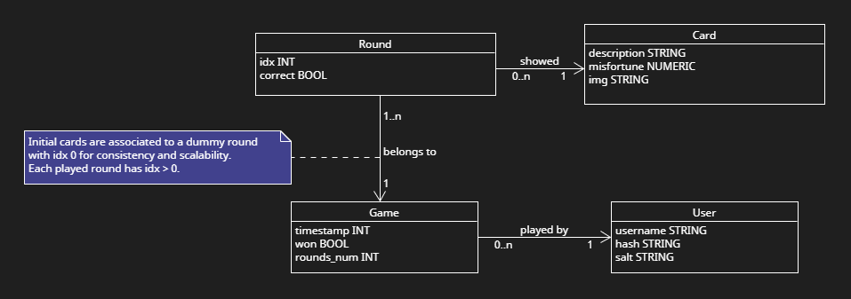

# Exam #1: "STUFF HAPPENS"

[Requirements document](https://docs.google.com/document/d/1M33wjx0DTgZSIBhdLQc1-jQdQ6znLe7BbjRz0w3FLe0/edit?tab=t.0#heading=h.dsoclu9d3dge)

**Area of life**: Commuting students' life.

## Student: s333236 GIUSEPPE EMANUELE MESSINA

[](https://classroom.github.com/a/uNTgnFHD)

## Screenshots



<p align="center"><em>Figure 1. Example gameplay screen showing a round in progress.</em></p>



<p align="center"><em>Figure 2. Example history screen showing the saved game records.</em></p>

## Users Credentials

| Username | Password   | Notes                 |
| -------- | ---------- | --------------------- |
| maurizio | ilmago     | has played some games |
| giovanni | lostregone |

## React Client Application Routes

| Route           | Description                                                                                                 | Reachability                                                   |
| --------------- | ----------------------------------------------------------------------------------------------------------- | -------------------------------------------------------------- |
| `/`             | Home page, containing instructions and the Play button.                                                     | Link in the left side of the navbar.                           |
| `/game`         | Route where the game is played.                                                                             | Play button in the Home page.                                  |
| `/login`        | Contains the Login form allowing a user to log into the webapp. Redirects to Home for already logged users. | Login button on the right side of the navbar.                  |
| `/user/history` | Shows the history of saved games for the logged user. Redirects to Home for anonymous users.                | User dropdown on the right side of the navbar, once logged in. |
| `*`             | Any other route not matching the above patterns shows a Not Found message.                                  | —                                                              |

## React Components

- [`App`](./client/src/App.jsx): Manages the application's routing, authentication state, and global alert messages.
- [`DefaultLayout`](./client/src/components/DefaultLayout.jsx): Provides the main layout structure, including the navigation header and alert messages.
- [`NavHeader`](./client/src/components/NavHeader.jsx): Displays the navigation bar with the home link, dark mode toggle, and user dropdown / login button.
- [`UserDropdown`](./client/src/components/UserDropdown.jsx): Provides the user-specific options of viewing history and logging out.
- [`Instructions`](./client/src/components/Instructions.jsx): Displays the game's instructions and a play button.
- [`Login`](./client/src/components/Login.jsx):
  - `LoginForm`: Handles user login functionality with a form.
  - `LoginButton`: Provides a button to navigate to the login page.
- [`History`](./client/src/components/History.jsx): Shows the logged user's game history with details of each game.
- [`Game`](./client/src/components/Game.jsx):
  - `Game`: Manages the game logic, including rounds, card placement, and game status.
  - `PlaceCardButton`: Button to place a card in the deck during a round.
  - `PlayButton`: Versatile button to start or restart the game, or proceed to the next round.
  - `CountDownProgressBar`: Displays a countdown timer for the current round.
  - `GameCard`: Represents a card in the game with its description, image, and optional misfortune value.
- [`NotFound`](./client/src/components/NotFound.jsx): Displays a message for unmatched routes.

## API Server Routes

All response bodies, unless specified, are of type `application/json`.

All response bodies indicated below refer to the nominal response in absence of errors, and unless specified otherwise, they respond with code 200.\
If an error occurs, every route will respond with an error code and the following body format:

```jsonc
{
  "message": /* ... */,
  "type": /* identifies the error class */,
  "stack": /* stack trace, only if DEBUG, only for type Error */,
}
```

GET `/`

- **Description**: Dummy home route for test purposes
- **Request Parameters**: None
- **Response Body**: `{ message: "STUFF HAPPENS" }`

### User

Routes for retrieving information about the logged user.

- GET `/user`

  - **Description**: Retrieves the logged-in user's information
  - **Request Parameters**: None
  - **Response Body**: User details

    Example:

    ```json
    {
    	"id": 1,
    	"username": "maurizio"
    }
    ```

- GET `/user/history`

  - **Description**: Fetches the history of saved games for the logged-in user.
  - **Request Parameters**: None.
  - **Response Body**: Array containing each saved game information, in descending date order.

    Example:

    ```jsonc
    [
    	{
    		"id": 1,
    		"timestamp": 1691234567890, // UTC
    		"won": true,
    		"rounds_num": 6, // played rounds
    		"rounds": [
    			// rounds with idx = 0 hold the initial cards
    			{
    				"idx": 0,
    				"card": {
    					"id": 16,
    					"description": "Card A",
    					"misfortune": 25
    				}
    			},
    			/* other rounds for initial cards ... */
    			// rounds with idx > 0 hold the played cards
    			{
    				"idx": 1,
    				"card": {
    					/* ... */
    				},
    				"correct": true
    			}
    			/* other played cards ... */
    		]
    	}
    	/* other games ... */
    ]
    ```

### Game

These routes are accessible by both logged and anonymous users.\
The current game is identified by the signed `openGame` cookie (automatically set).\
Multiple concurrent anonymous users are supported (uniquely identified by the cookie).\
Pending games (started and not finished) have a self-destruction watchdog set to 1 hour.

- POST `/games`

  - **Description**: Starts a new game associated to the current user (logged or anonymous). Closes any existing open game already associated to the user. Generates the `openGame` cookie to identify the current game.
  - **Request Parameters**: None
  - **Response Body**: The initial cards in the deck for the new game

    Example:

    ```jsonc
    {
    	"cards": [
    		// img is the name of the png file under storage/public/images
    		{ "id": 10, "description": "Card A", "img": "card-a" }
    		/* other initial cards ... */
    	]
    }
    ```

- POST `/games/current/rounds`

  - **Description**: Requests a new round for the current game. Starts the timeout countdown.
  - **Request Parameters**: None
  - **Response Body**: The new card for the new round and the current game status

    Example:

    ```jsonc
    {
    	"card": { "id": 10, "name": "Card D", "img": "card-d" },
    	"status": { "fails_left": 3, "successes_left": 3 }
    	// if fails_left reaches 0, the game is lost.
    	// if successes_left reaches 0 before fails_left, the game is won.
    }
    ```

- POST `/games/current/rounds/pending`

  - **Description**: Submits the round choice (identified by `prev` and `next` misfortune values). If the game is over, removes the `openGame` cookie, and if the user is logged it writes the game to their history. The request parameters are ignored if the server-side round timer timed out (this call was made too late), and the round choice is set to incorrect. If either one of the parameters is not set, the round is considered timed-out client-side, hence also incorrect.
  - **Request Parameters**:
    - `prev` (optional, numeric): Previous card misfortune value.
    - `next` (optional, numeric): Next card misfortune value.
  - **Response Body**: The current game status, information on the round, and the round's card full info (only if the choice was correct).

    Example:

    ```jsonc
    {
    	"status": {
    		"game_over": false, // true if this was the ending round
    		"fails_left": 3, // decremented if choice not correct
    		"successes_left": 2 // decremented if choice correct
    	},
    	"last_round": {
    		// info on this round
    		"idx": 1, // round number
    		"card_id": 10, // card id of this round
    		"correct": true, // choice was correct or not (false if timed out)
    		"timed_out": false // either the server or client roud timer timed out
    	},
    	// full info of the round's card (null if choice is not correct)
    	"reveal_card": { "id": 10, "name": "Card D", "img": "card-d", "misfortune": 5 }
    }
    ```

### Authentication

- POST `/sessions`

  - **Description**: Logs in a user using their username and password.
  - **Request Parameters**:
    - `username` (string): The username of the user.
    - `password` (string): The password of the user.
  - **Response Body**: same as GET `/user`

- DELETE `/sessions/current`
  - **Description**: Logs out the currently logged-in user.
  - **Request Parameters**: None.
  - **Response Body**: None (204 No Content).

### Static files

- GET `/static/<file>`
  - **Description**: Serves static files from the `storage/public` directory.
  - **Request Parameters**: None.
  - **Response Body**: The requested static file (e.g., an image or document).

## Database Tables



<p align="center"><em>Figure 3. Database tables and relationships.</em></p>

| Table  | Columns                                 | Contains                                                                                                                   |
| ------ | --------------------------------------- | -------------------------------------------------------------------------------------------------------------------------- |
| users  | id, username, hash, salt                | registered users                                                                                                           |
| cards  | id, description, misfortune, img        | playable cards for the game                                                                                                |
| games  | id, user_id, timestamp, won, rounds_num | saved games for each user                                                                                                  |
| rounds | id, game_id, idx, card_id, correct      | saved rounds for each saved game, including dummy rounds to hold the initial cards (to exploit the round-game association) |

### Schema

All tables contain the `id` field: `INTEGER NOT NULL UNIQUE PRIMARY KEY AUTOINCREMENT`.

#### user

| Column   | Type                 | Description                      |
| -------- | -------------------- | -------------------------------- |
| username | TEXT NOT NULL UNIQUE | Username used for login          |
| hash     | TEXT NOT NULL        | Scrypt hashed password for login |
| salt     | TEXT NOT NULL        | Scrypt password salt             |

#### cards

| Column      | Type                    | Description                                                                              |
| ----------- | ----------------------- | ---------------------------------------------------------------------------------------- |
| description | TEXT NOT NULL           | Description of the card                                                                  |
| misfortune  | NUMERIC NOT NULL UNIQUE | Misfortune value associated to card                                                      |
| img         | TEXT NOT NULL           | Image filename for the card. The full public static path is reconstructed on the client. |

#### games

| Column     | Type                                  | Description                                           |
| ---------- | ------------------------------------- | ----------------------------------------------------- |
| user_id    | INTEGER NOT NULL REFERENCES users(id) | Associates a game to a user                           |
| timestamp  | INTEGER NOT NULL                      | UTC timestamp when the game was saved                 |
| won        | INTEGER NOT NULL                      | Boolean, whether the game was won (1: true, 0: false) |
| rounds_num | INTEGER NOT NULL                      | Number of rounds played in the game                   |

#### rounds

| Column  | Type                                  | Description                                                                         |
| ------- | ------------------------------------- | ----------------------------------------------------------------------------------- |
| game_id | INTEGER NOT NULL REFERENCES games(id) | Associates a round to a game                                                        |
| idx     | INTEGER NOT NULL                      | Index of the round within the game (0 for initial cards, > 0 for each played round) |
| card_id | INTEGER NOT NULL REFERENCES cards(id) | Associates a round to a card                                                        |
| correct | INTEGER NOT NULL                      | Boolean, whether the round was answered correctly (1: true, 0: false)               |
